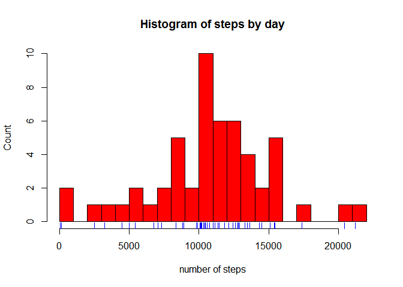
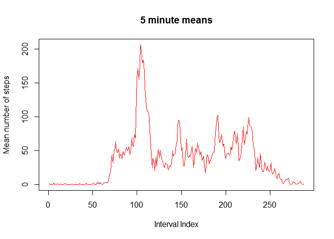
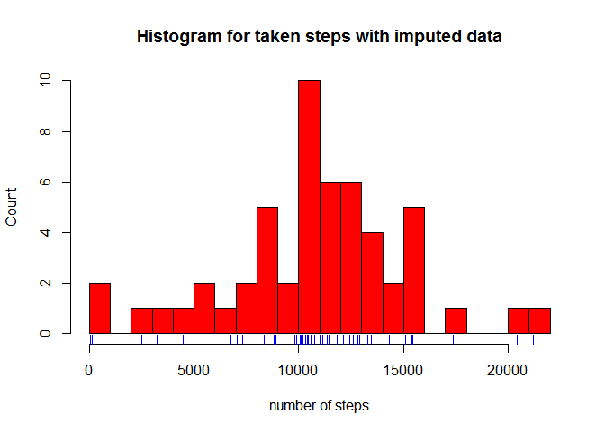
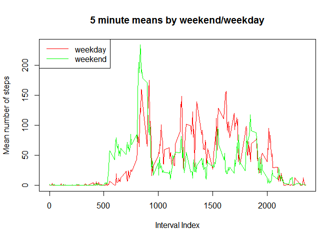

# Reproducible Research: Peer Assessment 1

```r
require(plyr)
```

```
## Loading required package: plyr
```

```r
require(Hmisc)
```

```
## Loading required package: Hmisc
```

```
## Loading required package: lattice
```

```
## Loading required package: survival
```

```
## Loading required package: Formula
```

```
## Loading required package: ggplot2
```

```
## 
## Attaching package: 'Hmisc'
```

```
## The following objects are masked from 'package:plyr':
## 
##     is.discrete, summarize
```

```
## The following objects are masked from 'package:base':
## 
##     format.pval, round.POSIXt, trunc.POSIXt, units
```

```r
require(Amelia)
```

```
## Loading required package: Amelia
```

```
## Loading required package: Rcpp
```

```
## ## 
## ## Amelia II: Multiple Imputation
## ## (Version 1.7.4, built: 2015-12-05)
## ## Copyright (C) 2005-2016 James Honaker, Gary King and Matthew Blackwell
## ## Refer to http://gking.harvard.edu/amelia/ for more information
## ##
```

```r
require(timeDate)
```

```
## Loading required package: timeDate
```

## Loading and preprocessing the data

```r
data <- read.csv("activity.csv")
```

## What is mean total number of steps taken per day?
Let's first look at the histogram of the steps column. As we can see the majority of the days feature from 7000 to 13000 steps a day.

```r
stepsByDay <- tapply(data$steps, data$date, FUN=sum)
hist(stepsByDay, main="Histogram of steps by day", xlab="number of steps", ylab="Count", breaks = 25, col="red")
rug(stepsByDay, col="blue")
```

\

Now let's look at Mean and Median of steps per day. Both are pretty much the same and around 10765 steps a day. That confirms what we see in the histogram.

```r
c(mean = mean(stepsByDay, na.rm=TRUE),median = median(stepsByDay, na.rm=TRUE))
```

```
##     mean   median 
## 10766.19 10765.00
```

## What is the average daily activity pattern?
The daily activity pattern looks like this:

```r
stepsByInt <- tapply(data$steps, data$interval, FUN=mean, na.rm=TRUE)
plot(stepsByInt, type="l", main="5 minute means", ylab="Mean number of steps", xlab="Interval Index", col="red")
```

\
Not surprising, our guy does not move while sleeping and gets active after that around the 65th interval. Assuming the series starts at midnight, he seems to get up around 5.30am. The steps peek around the 105th interval which is around 8.45am. The value of the peek is:

```r
max(stepsByInt)
```

```
## [1] 206.1698
```

## Imputing missing values
First we can look at the summary to find out how many NAs are in the data set.

```r
summary(data)
```

```
##      steps                date          interval     
##  Min.   :  0.00   2012-10-01:  288   Min.   :   0.0  
##  1st Qu.:  0.00   2012-10-02:  288   1st Qu.: 588.8  
##  Median :  0.00   2012-10-03:  288   Median :1177.5  
##  Mean   : 37.38   2012-10-04:  288   Mean   :1177.5  
##  3rd Qu.: 12.00   2012-10-05:  288   3rd Qu.:1766.2  
##  Max.   :806.00   2012-10-06:  288   Max.   :2355.0  
##  NA's   :2304     (Other)   :15840
```
As can be seen, 2304 values are missing.
To impute the missing values we use the R package Amelia which does the job for us. As this is not about creating sophisticated imputing strategies, let's just go with some basic parameters and take the first imputed data set.


```r
a <- amelia(data, idvars = c('date'),bound = rbind(c(1, 0, Inf)))
imputedData <- a$imputations[1]$imp
```

Looking at the summary of the imputed data we can see that all missing data have been filled.

```r
summary(imputedData)
```

```
##      steps                date          interval     
##  Min.   :  0.00   2012-10-01:  288   Min.   :   0.0  
##  1st Qu.:  0.00   2012-10-02:  288   1st Qu.: 588.8  
##  Median :  0.00   2012-10-03:  288   Median :1177.5  
##  Mean   : 46.29   2012-10-04:  288   Mean   :1177.5  
##  3rd Qu.: 40.00   2012-10-05:  288   3rd Qu.:1766.2  
##  Max.   :806.00   2012-10-06:  288   Max.   :2355.0  
##                   (Other)   :15840
```

Looking at the histogram we notice that it looks pretty similar to the one we have seen before, but shifted to the right.

```r
imputedStepsByDay <- tapply(imputedData$steps, imputedData$date, FUN=sum)
hist(stepsByDay, main="Histogram for taken steps with imputed data", xlab="number of steps", ylab="Count", breaks = 25, col="red")
rug(stepsByDay, col="blue")
```

\

Not surprisingly, the mean and median of the steps by day in the imputed data increase in comparison to the original data. As we only impute positive numbers (since negative steps doesn't make sense), the sum of daily steps can only get larger which than of course results in a higher mean and median

```r
c(mean = mean(imputedStepsByDay, na.rm=TRUE),median = median(imputedStepsByDay, na.rm=TRUE))
```

```
##     mean   median 
## 13332.83 11458.00
```

## Are there differences in activity patterns between weekdays and weekends?

Note: we are using the original data set for this part.
Creating the weekend/weekday factor

```r
data$weekDay <- factor(isWeekday(data$date, wday = 1:5), levels=c(TRUE,FALSE), labels=c("weekend", "weekday"))
```

Putting the new variable in a plot shows that the guy

```r
stepsByDay <- aggregate(data$steps ~ data$interval + data$weekDay, data, mean)
names(stepsByDay)<-c("interval", "weekDay", "stepMeans")
par(mfrow=c(1,1))
with(stepsByDay, plot(stepMeans ~ interval, type="n", main="5 minute means by weekend/weekday",ylab="Mean number of steps", xlab="Interval Index"))  
with(stepsByDay[stepsByDay$weekDay == "weekday",], lines(stepMeans ~ interval, type="l", col="red"))  
with(stepsByDay[stepsByDay$weekDay == "weekend",], lines(stepMeans ~ interval, type="l", col="green" ))  
legend("topleft", lty=c(1,1), col = c("red", "green"), legend = c("weekday", "weekend"), seg.len=3)
```

\
